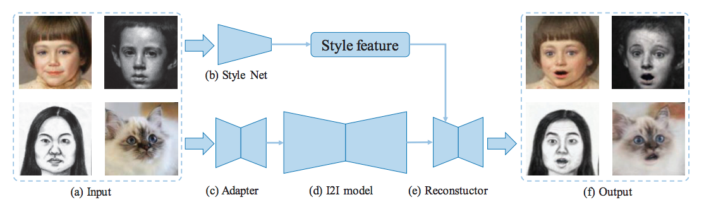

# Domain Adaptive Image-to-image Translation

This is a pytorch project for the paper **Domain Adaptive Image-to-image Translation** by Ying-Cong Chen, Xiaogang Xu, and Jiaya Jia presented at **CVPR2020**.

## Introduction
Unpaired image-to-image translation (I2I) has achieved great success in various applications. However, its generalization capacity is still an open question.
In this paper, we show that existing I2I models do not generalize well for samples outside the training domain. The cause is twofold.
First, an I2I model may not work well when testing samples are beyond its valid input domain. Second, results could be unreliable if the expected output is far from what the model is trained. To deal with these issues, we propose the Domain Adaptive Image-To-Image translation (DAI2I) framework that adapts an I2I model for out-of-domain samples.
Our framework introduces two sub-modules – one maps testing samples to the valid input domain of the I2I model, and the other transforms the output of I2I model to expected results.



[paper link](https://jiaya.me/papers/dai2i_cvpr20.pdf)

## Dependencies
* [Python 3.6+](https://www.continuum.io/downloads)
* [PyTorch 0.4.0+](http://pytorch.org/)

## Requirement

- Hardware: 4 GPUs (better with >=11G GPU memory)

## Train

### Dataset

Download datasets from [google pan](https://drive.google.com/file/d/1zQ3EGO7O01xMKcMZQKtMLQm096ApJ7MF/view?usp=sharing) and place them under the "datasets"


### I2I Models

In the experiments, we use the stargan model for cross-domain expression manipulation, and CR-GAN model for cross-domain novel view synthesis.
These models can be downloaded from [google pan](https://drive.google.com/file/d/1zQ3EGO7O01xMKcMZQKtMLQm096ApJ7MF/view?usp=sharing).

### Application: Cross-domain Expression Manipulation

```
python run_expression_manipulation.py --config_path config/expression_manipulation/options.yaml --save_dir checkpoints/expression_manipulation -gpu 0,1,2,3
```


### Application: Cross-Domain Novel View Synthesis

```
python run_view_synthesis.py --config_path config/view_synthesis/options.yaml --save_dir checkpoints/view_synthesis -gpu 0,1
```


## Test


### Application: Cross-domain Expression Manipulation

```
python test_expression_manipulation.py test --save_dir results --data_dir datasets/joint_dataset/test --model_path checkpoints/expression_manipulation
```


### Application: Cross-Domain Novel View Synthesis

```
python test_view_synthesis.py test --save_dir results/sketch --data_dir datasets/sketch_dataset/test --model_path checkpoints/view_synthesis
python test_view_synthesis.py test --save_dir results/painting --data_dir datasets/painting_dataset/test --model_path checkpoints/view_synthesis
```


## Citation Information

If you find the project useful, please cite:

```
@inproceedings{chen2020dai2i,
  title={Domain Adaptive Image-to-image Translation},
  author={Ying-Cong Chen, Xiaogang Xu and Jiaya Jia},
  booktitle={CVPR},
  year={2020}
}
```

## Acknowledgments
This source code is inspired by [Facelet_Bank](https://github.com/dvlab-research/Facelet_Bank), stargan[https://github.com/yunjey/stargan], CRGAN[https://github.com/bluer555/CR-GAN]

## Contributions
If you have any questions/comments/bug reports, feel free to e-mail the author Ying-Cong Chen ([yingcong.ian.chen@gmail.com](yingcong.ian.chen@gmail.com)) or Xiaogang Xu ([xgxu@cse.cuhk.edu.hk](xgxu@cse.cuhk.edu.hk)).
